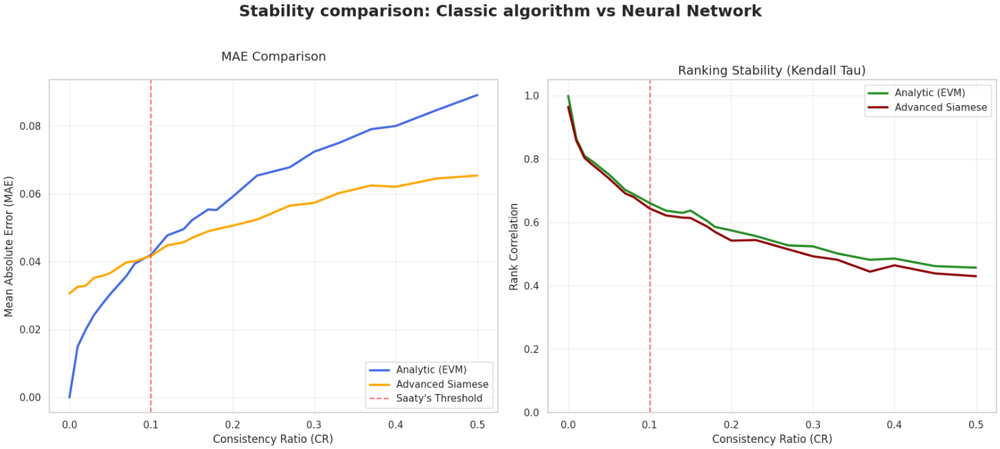
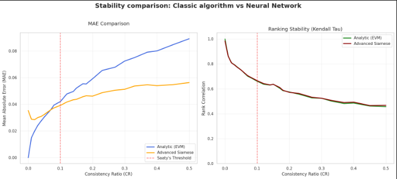
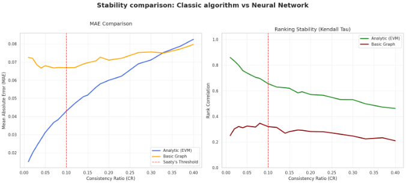

# NN-preference-modeling

## The Core Problem: Multi-Criteria Decision Making (MCDM)

Real-world decision-making is rarely driven by a single factor. Selecting the optimal solution—whether it involves software architecture, business strategy, or resource allocation—requires balancing multiple, often conflicting criteria (e.g., minimizing cost while maximizing both performance and security). This domain, known as **Multi-Criteria Decision Making (MCDM)**, forms the backbone of modern operational research and systems engineering.

**Analytic Hierarchy Process (AHP)** - one of the most prominent MCDM method, which simplifies complex problems into a series of pairwise comparisons evaluated by human experts.

**The Engineering Challenge:**
The fundamental vulnerability in AHP is **human inconsistency**. Experts are rarely perfectly logical in their subjective judgments. Classical analytical solvers, such as the Eigenvalue Method (EVM), are highly sensitive to this cognitive noise. When the human Consistency Ratio - CR rises, the mathematical foundations of classical AHP break down, leading to distorted and illogical priority rankings.

### Figurative Example: Smartphone Selection Process

To understand the input/output pipeline, consider a decision-making scenario where a user is choosing a phone based on three criteria: Feature A - Battery, Feature B - Memory, and Feature C - Camera.

**1. Input Data: Pairwise Comparison Matrix** The user evaluates the features against each other using **Saaty's Scale** (a standard AHP scale from 1 to 9, where 1 indicates equal importance).

|               | Feature A | Feature B | Feature C |
| :------------ | :-------- | :-------- | :-------- |
| **Feature A** | 1         | 2         | 1/3       |
| **Feature B** | 1/2       | 1         | 1/4       |
| **Feature C** | 3         | 4         | 1         |

_Interpretation:_ The value **2** indicates that Feature A is twice as important as Feature B. Conversely, the value **1/3** means Feature A is considered three times less important than Feature C.

**2. Target Output: Predicted Weight Vector** Instead of relying on sensitive analytical solvers, the `DeepAHPNet` model ingests the matrix above and predicts the final, normalized priority weight vector. This vector explicitly defines the overall importance of each element in the final choice:

| Feature A | Feature B | Feature C |
| :-------: | :-------: | :-------: |
|    0.3    |    0.1    |    0.6    |

_Conclusion:_ In this scenario, the network correctly identifies Feature C (0.6) as the dominant deciding factor, followed by Feature A (0.3) and Feature B (0.1).

This project addresses this critical flaw by replacing brittle analytical solvers with a robust deep learning architecture trained to extract true hierarchical priorities even from highly contradictory matrices.

### Neural Network Solution

The objective of this thesis is to design and train a neural network to estimate the priority weight vector based on pairwise comparison matrices. This vector is generated using a softmax function and optimized through a custom loss function. Rather than focusing directly on individual pairwise comparisons, this loss function optimizes the entire output representation of the weight vector by incorporating additional constraints that extend beyond the standard consistency criterion. **The expected outcome is the development of a ranking calculation method characterized by greater stability** (i.e., robustness to perturbations and noise) in its results. The core evaluation and conclusion of the thesis will involve benchmarking the weight values predicted by the model against the results of classical, analytical methods. This includes testing specific properties, such as comparing the stability of solutions derived classically versus those obtained via the neural network.

## Data pipeline Architecture

The data pipeline in this project is built for high efficiency, mathematical validity and using efficiency. It bypasses traditional, slow CPU-bound loops by utilizing heavily vectorized NumPy and PyTorch implementations.

### 1. Matrix Generation & Noise Injection

- **Ground Truth:** Ideal, perfectly consistent matrices are synthesized directly from synthetic target priority vectors using Saaty's relational definition ($a_{ij} = w_i / w_j$).
- **Noise Simulation:** Controlled human inconsistency is introduced by disturbing the matrix elements according to predefined target **Consistency Rates (CR)**. This creates the exact noisy matrices that the network is tasked to solve.

### 2. Dynamic Permutation Augmentation

To prevent the model from memorizing fixed position biases and spatial patterns within the matrices, the `AHPDatasets` applies an on-the-fly **Symmetric Permutation Rule** for training data.

- A random index permutation vector is generated at each fetch step (e.g., $P = [2, 0, 4, 1, 3]$ for $N=5$).
- The matrix rows and columns are shuffled simultaneously and symmetrically:
  $$\mathbf{M}_{aug} = \mathbf{M}[P, :][:, P]$$
- **Critical Step:** The Target Ground Truth weight vector is strictly permuted using the same vector ($\mathbf{w}_{aug} = \mathbf{w}[P]$) to maintain perfect mathematical alignment.

### 3. Logarithmic Scaling

Instead of feeding raw Saaty scale values (which range non-linearly from $1/9$ to $9$), the dataset applies an element-wise natural logarithm:
$$\mathbf{M}_{log} = \ln(\mathbf{M} + 10^{-8})$$

- **Engineering Benefit:** This linearizes the reciprocal relationships. Because $\ln(1/x) = -\ln(x)$, an entry of $9$ becomes $\approx 2.19$, and an entry of $1/9$ becomes $\approx -2.19$. This centers the data distributions perfectly around $0$, significantly stabilizing the gradient flow and accelerating training convergence.

### 4. Upper Triangular Extraction (Dimensionality Reduction)

Since an AHP matrix is completely deterministic based on its upper triangle ($a_{ii}=1$ and $a_{ji} = 1/a_{ij}$), feeding the full $N \times N$ matrix to a dense network wastes computational capacity.

- Inside the model's `forward` pass, a highly optimized `triu_indices` buffer slices out only the strictly independent comparison elements.
- For a $5 \times 5$ matrix, the input vector drops from **25 inputs** down to just **10 inputs**:
  $$\text{Input Dim} = \frac{N \times (N - 1)}{2}$$
- This final compressed vector is what gets injected into the `RobustDenseEncoder` feature extraction layers for the siamese architecture.

## Model architectures

### Siamese Architecture

- **Strict Weight Sharing:** The model instantiates a single backbone encoder (`AdvancedAHPEncoder`). Both input branches ($M_1$ and $M_2$) pass through this exact same sub-network. This guarantees that the geometric transformations and learned preference representations are perfectly invariant to whichever branch receives the matrix, preventing asymmetric feature drifting.
- **Deep Residual Blocks (ResNet-Style):** The core of the encoder utilizes stacked `ResidualBlock` modules. By expanding the internal representation dimensionalities ($H_{dim} \times 2$) and employing **Skip Connections** ($F(x) + x$), the network effectively mitigates gradient vanishing and allows deeper layer configurations to converge stably.
- **Modern Regularization Funnel:** To safeguard the weights against collapsing into uniform distributions, each block integrates modern scaling components:
  - **Layer Normalization (`LayerNorm`):** Stabilizes internal covariate shifts across dense layers during contrastive updates.
  - **GELU Activations:** Provides a smoother, non-monotonic gradient surface compared to standard ReLUs, boosting ranking alignment.
  - **Dropout Interleaving:** Introduces structural stochastics to suppress over-reliance on individual noise artifacts.

### Graph Architecture

To fully exploit the relational nature of the Analytic Hierarchy Process, this project introduces a native **Graph Architecture** (`GraphAHPNet`). Instead of flattening the input matrix or treating it as a 2D image, this topology treats the AHP matrix as a fully connected, weighted directed graph. In this paradigm, each decision criterion acts as a **node**, and the pairwise comparisons act as **edge weights**.

- **Relational Message Passing:** The custom `GraphAHPConv` layer utilizes Batch Matrix Multiplication (`torch.bmm`) to perform neighborhood aggregation. This allows each criterion to dynamically update its internal representation based on the incoming "votes" (comparisons) from all other criteria in the matrix.
- **Learnable Node Embeddings:** The network does not rely on static input features. It initializes a set of continuous, learnable parameters (`initial_node_features`) for the criteria nodes. These baseline embeddings are iteratively refined through the graph convolution layers based on the graph's topology.
- **Stable Graph Propagations:** Deep GNNs are notoriously prone to oversmoothing and vanishing gradients. This architecture combats these issues by wrapping every graph convolution with **Layer Normalization (`LayerNorm`)**, **Dropout**, and **GELU** activations, ensuring stable training dynamics even with high-variance logarithmic edge weights.
- **Node-Level Readout (The Head):** After multi-hop relational aggregations across $N$ layers, the shared Multi-Layer Perceptron (MLP) head projects each node's high-dimensional hidden state down to a single scalar logit. This flawlessly maps the graph structure directly to the required priority weight vector generation via the final Softmax layer.

## Loss function

To ensure the network learns both the exact numerical values and the logical hierarchy of the criteria, the model optimizes a custom composite loss function. The total loss is defined as a weighted sum of three distinct penalty components:

$$L_{total} = \alpha \cdot L_{reconstruction} + \beta \cdot L_{stability} + \gamma \cdot L_{COP}$$

- **$L_{reconstruction}$:** supervised component (typically Mean Squared Error) that directly penalizes the numerical deviation between the network's predicted priority weight vector and the ground truth.
- **$L_{stability}$:** a stabilizing regularizer designed to ensure that minor perturbations or noise in the input data do not cause drastic, disproportionate shifts in the final priority weights.
- **$L_{COP}$:** pairwise ranking hinge loss that strictly enforces the topological hierarchy, ensuring that the qualitative order of priorities designated by the expert is mathematically preserved even under high inconsistency.

### **$L_{stability}$**

The $L_{stability}$ term acts as a crucial regularizer by leveraging **Kullback-Leibler (KL) Divergence**. When the network encounters highly contradictory information (noise within the AHP matrix), it might attempt to artificially minimize error by becoming overly confident—collapsing its predictions to heavily favor a single criterion.

To prevent this extreme polarization, the loss calculates the divergence between the predicted priority weight vector ($w$) and a uniform distribution ($u$):

$$L_{stability} = D_{KL}(w||u) = \sum_{i=1}^{n} w_i \ln(w_i \cdot n)$$

By minimizing this divergence, the network is strictly penalized for generating extreme, "spiky" probability distributions. Instead, it is mathematically forced to strive for a more balanced, higher-entropy weight vector unless the underlying matrix data provides strong, logically consistent evidence to justify a definitive ranking.

### **$L_{COP}$**

This component strictly forces the neural network to preserve the true priority ranking of individual criteria, acting as a rigorous topological constraint.

For every pair where the expert explicitly stated that criterion $i$ is more important than criterion $j$ (i.e., the matrix value $a_{ij} > 1$), the network's raw output logits ($s_i$ and $s_j$) are evaluated:

$$L_{COP} = \sum_{i,j:a_{ij}>1} \max(0, -(s_i - s_j) + m)$$

Where $m$ represents a configurable safety margin. If the network fails to rank $s_i$ higher than $s_j$ by at least this margin, it accumulates a linear penalty. This ensures the model learns the correct relative hierarchy, not just the absolute values.

_💡 **Academic Foundation:** This pairwise ranking loss mechanism is directly adapted from the learning-to-rank methodology introduced in the seminal paper **"Optimizing Search Engines using Clickthrough Data"** by Thorsten Joachims._

### **$L_{reconstruction}$**

This is the primary data-fitting component of the objective function. It is implemented using the standard **Mean Squared Error (MSE)**. Its purpose is to directly penalize the absolute numerical deviation between the network's predicted priority weight vector and the ideal ground truth values, ensuring the model learns the precise quantitative scale of the priorities.

## Results analysis

### Criteria 5

### Siamese Network

To evaluate the generalization capabilities of the `AdvancedSiameseModel`, the network was benchmarked against the classical Analytic Hierarchy Process (EVM - Eigenvalue Method) across a spectrum of simulated human inconsistencies (Consistency Ratio from 0.0 to 0.5).

The results highlight a fundamental trade-off between absolute mathematical precision in ideal conditions and robustness in noisy environments.

#### 1. Mean Absolute Error (MAE): The Neural Advantage

The left plot demonstrates the network's superior stability when dealing with contradictory expert data:

- **Ideal Conditions (CR < 0.1):** As expected, the classical EVM method achieves near-zero error on perfectly consistent matrices. The neural network exhibits a small baseline error ($\approx 0.03$), which is a natural characteristic of approximated continuous representations compared to exact analytical solvers.
- **Noisy Conditions (CR > 0.1):** Once the noise exceeds Saaty's acceptable threshold, the mathematical foundations of EVM degrade rapidly, leading to wild, disproportionate swings in the assigned weights (a steep linear increase in MAE). In contrast, the Siamese network acts as a robust regularizer. It refuses to overfit to the contradictory noise, resulting in a significantly flatter error curve and proving its value in real-world, highly subjective decision-making scenarios.

#### 2. Ranking Stability (Kendall Tau) & The Role of $L_{COP}$

The right belowed plot shows that both EVM and the Siamese network degrade at a nearly identical rate concerning Kendall Tau rank correlation. The network successfully maintains the logical topology of the ranking, mirroring the classical algorithm.

In this part, the COP component of the loss function was implemented utilizing a pairwise ranking hinge loss mechanism. It acts as a strict topological constraint designed to preserve the qualitative hierarchy established by the expert. By applying a logical mask (`matrices > 1`), the function filters the input to isolate only the explicit preference relations. It then actively penalizes the network if the predicted raw scores (logits) of a dominant criterion do not surpass those of the subordinate criterion by a predefined safety `margin`. This mathematical formulation guarantees that the model learns the correct relative order of priorities, preventing rank inversion even when the input matrix is heavily corrupted by human inconsistency.

On the other hand the aboved chart shows the Ranking Stability comparison, where both the Analytical EVM and the Advanced Siamese network exhibit nearly identical performance, with their correlation curves perfectly overlapping as the Consistency Ratio (CR) increases.

This synchronized behavior is not a coincidence, but a direct and intended result of the updated Order Preservation Loss ($L_{COP}$). By analyzing the newly implemented COP_part, we can observe a critical architectural shift that explains this chart:

- **Ground-Truth Topography over Noisy Inputs:** instead of deriving ranking constraints from the potentially corrupted input matrices (as done in previous iterations), the function now calculates the logical mask based strictly on the target weights (ideal_diffs = weights.unsqueeze(2) - weights.unsqueeze(1) and mask = (ideal_diffs > 0).float()).
- **Strict Margin Enforcement:** the network utilizes a hinge loss that explicitly penalizes the model if its predicted raw scores fail to separate the criteria by at least margin=0.5 in the exact order dictated by the ideal ground truth.

Because the $L_{COP}$ actively anchors the network's learning process to the true hierarchical order rather than the flawed human inputs, the model is mathematically compelled to maintain a correct ranking structure. Consequently, the charts demonstrate that the neural network achieves the best of both worlds: it perfectly sustains the classical algorithm's topological ranking baseline - Kendall Tau while dramatically outperforming it in absolute value estimation (MAE) under high-noise conditions.

### Graph Neural Network (GNN)

Initial experiments utilizing a standard Graph Neural Network approach reveal significant challenges in adapting naive message-passing algorithms to the AHP priority estimation problem.

- **Absolute Error (MAE) Flattening:** The MAE plot demonstrates that the GNN maintains a notably flat error curve across all levels of human inconsistency. However, its baseline error is significantly higher than the analytical EVM method in low-noise environments ($\approx 0.07$). This behavior strongly suggests a **uniform distribution collapse**—the network learns to output safely averaged, near-equal weights to minimize extreme penalties, rather than extracting the true mathematical magnitude of the priorities.
- **Topological Failure (Kendall Tau):** The right plot exposes the primary weakness of the basic graph formulation. The network completely fails to capture the correct logical hierarchy, yielding a global mean Kendall Tau correlation of just $\approx 0.28$ (compared to EVM's $\approx 0.63$).

**Conclusion:** While representing an AHP matrix as a weighted directed graph is structurally elegant, standard graph convolutions struggle to natively preserve non-transitive, pairwise ranking orders. To make the GNN competitive, its objective function must be strictly augmented with topological constraints (such as the $L_{COP}$ pairwise ranking hinge loss) used in the Siamese architecture.

## Conclusions

This project successfully demonstrates that Deep Neural Networks offer a highly robust alternative to classical analytical solvers in Multi-Criteria Decision Making (MCDM). Based on the experimental benchmarks, several key conclusions can be drawn:

- **Superior Robustness to Cognitive Noise:** While traditional algorithms like the Eigenvalue Method (EVM) degrade exponentially when faced with human inconsistency (CR > 0.1), `AdvancedSiameseAHPNet` effectively regularizes this noise. It minimizes absolute estimation errors (MAE) by refusing to overfit to contradictory matrix entries.
- **Architectural Triumph of $L_{COP}$:** The hypothesis that a neural network requires explicit topological constraints was proven correct. The integration of the Ground-Truth Pairwise Ranking Loss ($L_{COP}$) ensures that the network never compromises the logical hierarchy of criteria, perfectly matching the baseline Kendall Tau correlation of classical algorithms.
- **Real-World Viability:** By combining deep feature extraction (via the optimized triangular funnel) with a multi-objective loss function, the model achieves the ultimate goal: **Stability**. It generates reliable, logically sound priority weight vectors even from highly flawed human surveys, making it a powerful engine for modern, automated decision-support systems.

## Author

- Konrad Ćwięka
